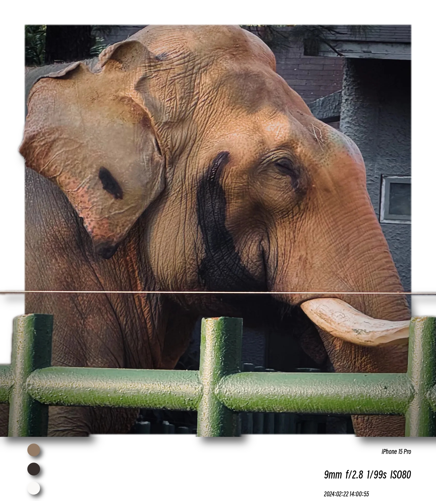
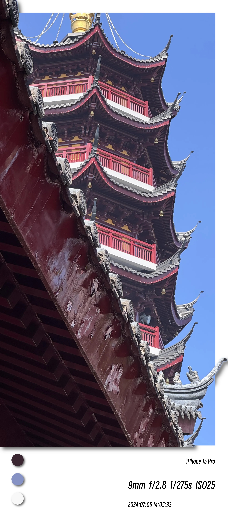

# 📷 空间感边框生成器

本项目是一个基于OpenCV、Gradio和深度学习的图片处理工具，支持拍立得风格边框、主色彩提取、深度图分区、EXIF信息展示等功能。适合摄影爱好者、AI艺术创作者和图像处理开发者。

## 示例图片






## 主要功能

- **拍立得风格边框**：为图片自动添加底部白边和主色彩圆点，支持阴影、角度、距离等参数自定义。
- **主色彩提取**：自动分析图片主色彩，并以圆形色块展示。
- **深度图处理**：支持深度图分区、动态滑条调节、分区渐变遮罩、深度图位移等。
- **EXIF信息展示**：自动读取并展示图片的相机参数（焦距、ISO、快门速度、拍摄时间等）。
- **可视化交互界面**：基于Gradio的Web界面，支持图片上传、参数滑条、实时预览。

## 目录结构

```
DepthEdge-Gen/
├── add_bottomborder.py
├── add_font.py
├── add_sideborder.py
├── combine_image.py
├── get_color.py
├── get_depthmap.py
├── get_imagemetadate.py
├── app.py
├── requirements.txt
├── font/
│   └── SmileySans-Oblique.ttf
├── model/
│   └── depth_anything_v2_vitl.pth
├── ...
```

## 快速开始

1. **环境准备**

   - Python 3.10+
   - 推荐使用虚拟环境

2. **安装依赖**

   **（可选）创建并激活虚拟环境**

   Windows 命令行：
   ```cmd
   python -m venv venv
   venv\Scripts\activate
   ```

   Mac/Linux:
   ```bash
   python3 -m venv venv
   source venv/bin/activate
   ```

   **安装依赖包**
   ```bash
   pip install -r requirements.txt
   ```

3. **下载深度模型权重**

   - 访问 [Depth Anything V2 Large 模型下载链接](https://huggingface.co/depth-anything/Depth-Anything-V2-Large/resolve/main/depth_anything_v2_vitl.pth?download=true)
   - 下载后重命名为 `depth_anything_v2_vitl.pth`，放入 `model/` 文件夹下

4. **下载字体文件**

   - 访问 [Smiley Sans 字体下载链接](https://github.com/atelier-anchor/smiley-sans/releases/download/v2.0.1/smiley-sans-v2.0.1.zip)
   - 解压后将 `SmileySans-Oblique.ttf` 放入 `font/` 文件夹下

5. **运行主界面**

   ```bash
   python app.py
   ```

6. **使用说明**

   

   - 上传图片后，可实时查看主色彩、深度分区、EXIF参数。
   - 可通过滑条调整图像裁剪、深度分区、阴影角度、阴影距离等参数，效果实时预览。
   - 点击“生成深度”即可生成空间感图片。
   - 支持保存拍立得风格图片。

## 主要依赖

- opencv-python
- numpy
- gradio
- scikit-learn
- pillow

## 进阶说明

- **深度图分区**：支持分位数动态分区，滑条控制叠加区块，边缘自动高斯模糊。
- **阴影参数**：可通过角度和距离滑条自定义色彩圆阴影方向和偏移。
- **自定义开发**：各功能模块均为独立Python文件，便于二次开发和集成。

## 参考/致谢

- [OpenCV](https://opencv.org/)
- [Gradio](https://gradio.app/)
- [Depth Anything V2](https://github.com/DepthAnything/Depth-Anything-V2/)
- [Smiley Sans](https://github.com/atelier-anchor/smiley-sans)

---

如有问题或建议，欢迎提交Issue或PR。
